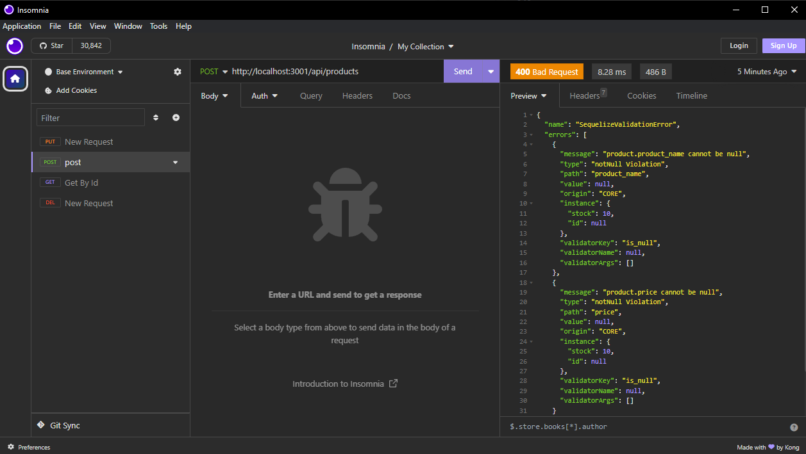

# 013-E-Commerce-Backend

## Description

The goal of this assignment was to take the given starter code and create the backend for an e-commerce site that uses Express.js API and Sequelize to interact with a MySQL database. The starter code included the models for Category, Product, ProductTag, and Tag, with the goal being to create the proper routes and associations to make the application functional.
 
## Table of Contents

- [Installation](#installation)
- [Usage](#usage)
- [License](#license)
- [Contributions](#contributions)
- [Images](#images)
- [Links](#links)

## Installation

`git clone https://github.com/Gagucci/013-E-Commerce-Backend.git to clone the repository`
`npm install to install dependencies`
`source the schema.sql file in the db folder to create the database`
`npm run seed to seed the database`
`npm start to start the server`

## Usage

A backend for an e-commerce site that uses Express.js API and Sequelize to interact with a MySQL database.

## License

This project is protected under the MIT license.
For more information visit [here](https://opensource.org/licenses/MIT).

## Contributions

Help received from TA's, my tutor Neil Dhand, and my fellow peers in the UCB Fullstack Bootcamp.

## images

## Links

[Link to GitHub Repository](https://github.com/Gagucci/013-E-Commerce-Backend.git)